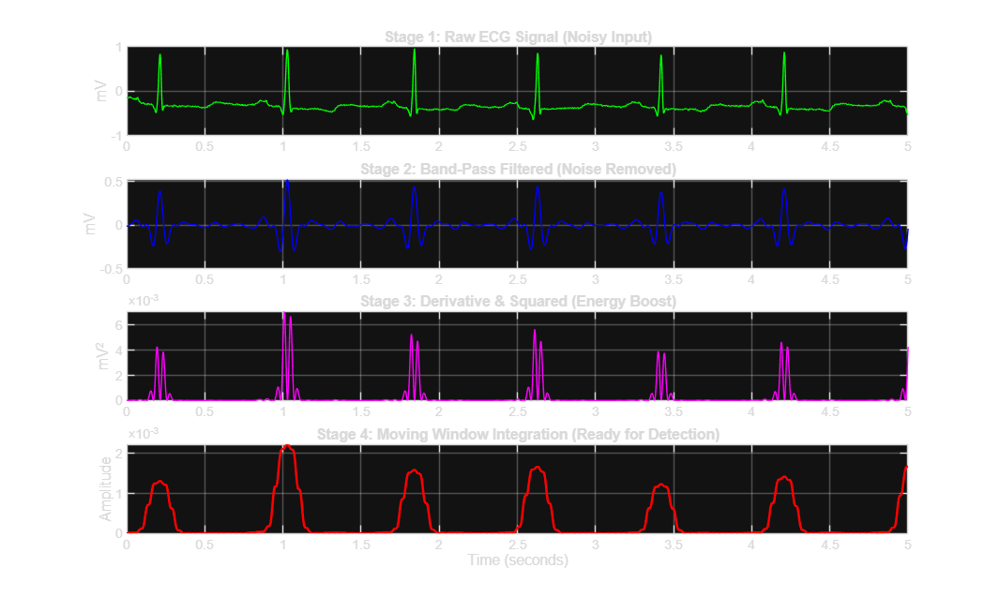
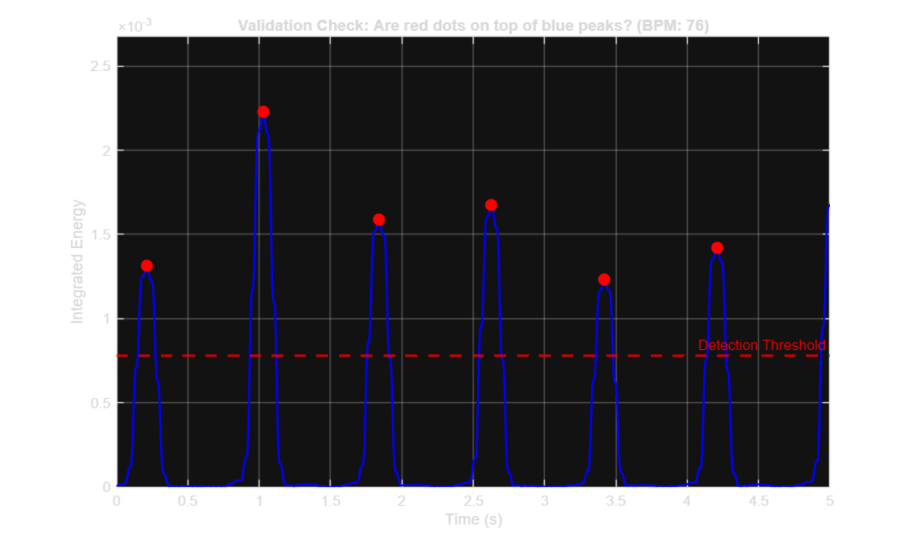
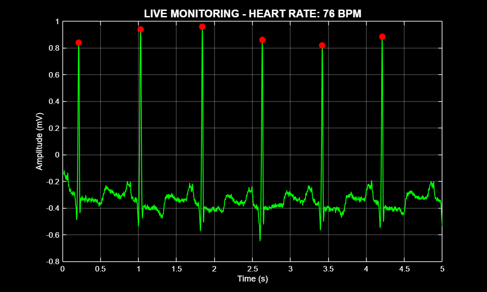

# ECG Signal Processing and Real-Time Monitoring with MATLAB & Simulink

A biomedical signal-processing project that demonstrates ECG preprocessing, QRS-energy enhancement, R-peak detection, heart-rate estimation, and real-time visualization using MATLAB and Simulink.

> **Scope:** This project is an educational engineering prototype. It does **not** perform clinical arrhythmia diagnosis or validated arrhythmia classification.

## Overview

The processing pipeline is inspired by the main stages of Pan–Tompkins-style QRS detection:

1. **Band-pass filtering (5–15 Hz)** to emphasize QRS-band energy.
2. **Differentiation and squaring** to enhance rapid slope changes.
3. **Moving-window integration (150 ms)** to form a smoother QRS-energy envelope.
4. **Heuristic threshold-based peak detection** using the integrated signal.
5. **Local R-peak refinement** by searching the raw ECG around each detected location.
6. **Heart-rate estimation** from successive R–R intervals.
7. **Simulink-based streaming simulation** for a real-time monitoring view.

## Implementation Details

- **Sampling frequency:** 360 Hz
- **Band-pass filter:** 3rd-order Butterworth, 5–15 Hz
- **Integration window:** 150 ms
- **Detection threshold:** 35% of the maximum integrated amplitude measured in the first 10 seconds
- **Minimum peak distance:** 200 ms
- **R-peak refinement:** local maximum search within ±20 samples of each detected location

The thresholding step is intentionally simple and serves as a demonstration rather than a robust patient-independent detector.

## Project Structure

```text
ECG_Heart_Monitor_Project/
├── main_analysis.m
├── realtime_monitor.slx
├── 100m.mat
├── README.txt
└── images/
    ├── signal_processing_stage.png
    ├── algorithm_validation.png
    ├── live_monitoring.png
    ├── model_review.png
    └── scope_output.png
```

### Main files

- **`main_analysis.m`** — loads the ECG, applies the signal-processing pipeline, detects/refines R-peaks, estimates heart rate, and generates visualization figures.
- **`realtime_monitor.slx`** — Simulink model used to demonstrate streaming-style ECG processing and monitoring.
- **`100m.mat`** — MAT-format ECG sample used by the project.

## Example Outputs

### Signal-processing stages



### Detection review



### Monitor-style visualization



## Requirements

- MATLAB
- Signal Processing Toolbox
- Simulink

## Running the Project

1. Clone the repository.
2. Open MATLAB and navigate to `ECG_Heart_Monitor_Project`.
3. Run:

```matlab
main_analysis
```

4. Review the generated signal-processing and R-peak detection figures.
5. Open `realtime_monitor.slx` and run the model after the MATLAB script has initialized the required workspace variables.

## Data Source

The sample is based on **record 100 from the MIT-BIH Arrhythmia Database**, distributed by PhysioNet. The original database contains two-channel ambulatory ECG recordings sampled at 360 Hz and includes expert beat annotations.

- PhysioNet: https://physionet.org/content/mitdb/1.0.0/
- Moody GB, Mark RG. *The impact of the MIT-BIH Arrhythmia Database.* IEEE Engineering in Medicine and Biology Magazine. 2001.

The dataset remains subject to its original PhysioNet data license; the repository's MIT license applies to the project code.

## Limitations

- The detector has not been evaluated here against reference beat annotations using sensitivity, positive predictive value, or timing-error metrics.
- The threshold is derived from a fixed fraction of the first 10 seconds and may not generalize to recordings with different amplitudes, rhythms, or noise levels.
- R-peak refinement searches for the local maximum in the raw signal, which may be unsuitable for inverted QRS morphologies.
- The displayed heart rate is an average derived from detected R–R intervals rather than a continuously updated clinical heart-rate estimate.
- This project is intended for learning and portfolio demonstration, not clinical use.

## License

Project code is released under the MIT License.
